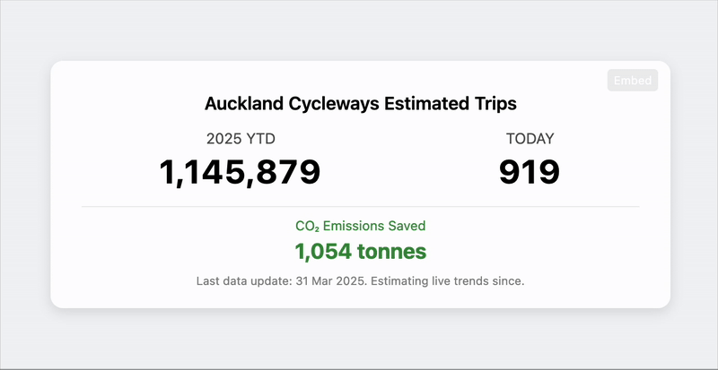

# Auckland Cycleways Live Counter



## Overview

This project provides a real-time visualization of cycling activity in Auckland, New Zealand. It displays current year-to-date cycling trips, daily trips, and CO₂ emissions saved through cycling instead of driving.

The counter combines actual trip data from Auckland Transport with statistical modeling to estimate trips between official data updates, providing a continuous and engaging visualization of cycling activity.

## Features

- **Real-time estimation** of cycling trips based on historical patterns
- **Seasonal adjustment** with different trip patterns for summer, autumn, winter, and spring
- **Day-type specific models** (weekday, weekend, and holiday patterns)
- **CO₂ emission savings** calculation based on Auckland Transport data
- **Responsive design** that works on mobile and desktop
- **Embeddable widget** for other websites with various size options
- **Accessibility features** including keyboard navigation and ARIA attributes
- **Cross-domain iframe communication** with resize handling
- **Efficient caching** to reduce API calls

## Live Demo

View the live counter: [https://cycleway.tfwelch.com/cycle-counter/](https://cycleway.tfwelch.com/cycle-counter/)

## Installation

1. Clone the repository:
   ```bash
   git clone https://github.com/yourusername/auckland-cycleways-counter.git
   ```

2. No build process needed - this is a static HTML/CSS/JS project.

3. Serve via any static web server or CDN.

## Usage

### Basic Usage

1. Open `index.html` in a web browser
2. The counter will automatically connect to the API and display real-time cycling data

### Embedding on Your Website

```html
<iframe src='https://cycleway.tfwelch.com/cycle-counter/' 
        style='border:none;width:100%;max-width:600px;height:170px;' 
        loading='lazy' 
        title='Auckland Cycleways Counter'>
</iframe>
```

Options for embedding:
- Standard size (600px × 170px)
- Compact size (400px × 140px)
- Custom size (user-defined)

## Data Sources

The counter uses real trip data provided by Auckland Transport, with the following additional parameters:

- **Average trip length**: 4.8km
- **CO₂ savings**: 192g CO₂/km emissions avoided by cycling instead of driving
- **Hourly distribution patterns** based on historical data analysis

## Technical Details

The application uses:
- Vanilla JavaScript with no frameworks
- Local storage for client-side caching
- Polyfills for cross-browser compatibility
- ResizeObserver for responsive iframe embedding
- Feature detection for progressive enhancement

## Project Structure

```
/
├── index.html           # Main HTML file
├── data/                # API endpoint for cycleway data
│   └── cycleway_data_annual.json
├── screenshots/         # Screenshots for documentation
└── README.md            # This file
```

## Methodology

The counter estimates cycling trips using:

1. **Base data**: Actual trips recorded through official counters up to the last data update
2. **Daily estimation**: Statistical models based on day type and season
3. **Hourly distribution**: Time-of-day patterns specific to weekdays, weekends, and holidays
4. **Seasonal factors**: Different cycling behaviors across summer, autumn, winter, and spring

## Contributing

Contributions are welcome! Please feel free to submit a Pull Request.

## License

This project is licensed under the MIT License - see the LICENSE file for details.

## Acknowledgements

- Auckland Transport for providing the cycling trip data
- Timothy F. Welch for development and maintenance
