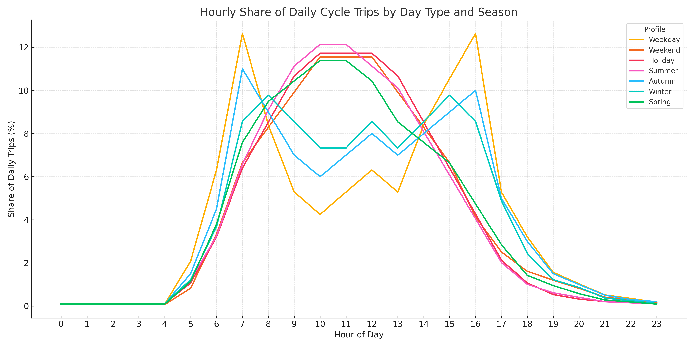

# Auckland Cycleways Counter - Technical Documentation

## Architecture Overview

The Auckland Cycleways Counter is a client-side web application built with vanilla JavaScript that provides real-time estimates of cycling trips in Auckland. This document explains the technical implementation details for developers interested in understanding or contributing to the project.

## Core Components

### 1. Data Handling & Estimation System

#### Base Data Acquisition
- The counter initially loads actual trip data from a JSON API endpoint.
- A caching system with localStorage reduces unnecessary API calls.
- The cache expires after 1 hour to ensure data stays relatively fresh.
- Fallback mechanisms are in place if the API fails or localStorage is unavailable.

#### Statistical Models
The estimation system uses several interconnected models:

```javascript
// Base estimates for different day types
const avgByDay = {
  weekday: 9600,
  weekend: 8200,
  holiday: 7254,
  summer: 10167,
  autumn: 9900,
  winter: 9536,
  spring: 9014
};

// Hourly distribution profiles
const hourlyProfiles = {
  weekday: [0.0009, 0.0009, 0.0009, 0.0009, 0.0009, 0.0215, 0.0653, 0.1307,
            0.0869, 0.0547, 0.044, 0.0547, 0.0653, 0.0547, 0.0869, 0.1091,
            0.1307, 0.0547, 0.0332, 0.0161, 0.0107, 0.0053, 0.0036, 0.0018],
  weekend: [0.0007, 0.0007, 0.0007, 0.0007, 0.0007, 0.0082, 0.0332, 0.0664,
            0.0827, 0.099, 0.1153, 0.1153, 0.1153, 0.099, 0.0827, 0.0664,
            0.0413, 0.025, 0.0161, 0.012, 0.0082, 0.0041, 0.0027, 0.0014],
  // Additional profiles...
};
```


The system:
1. Determines the current day type (weekday/weekend/holiday)
2. Selects the appropriate seasonal and daily profile
3. Applies time-of-day distribution factors
4. Calculates the per-second cycling rate
5. Accumulates this rate over time for smooth animation

#### Real-time Estimation
- `requestAnimationFrame` provides the timing loop for smooth counter updates
- Each animation frame calculates the incremental trips since the last frame
- Delta time compensation ensures consistent counting regardless of frame rate

### 2. UI Components

#### Counter Display
- Separate counters for YTD trips, daily trips, and CO₂ saved
- Number formatting with locale support
- Visual "pulse" animation when values change significantly

#### Embed Modal
- Modal dialog for embedding code options
- Size presets (standard, compact, custom)
- Clipboard API integration for easy copying
- Keyboard accessibility (focus trapping, escape key support)

### 3. Cross-Domain Communication

For embedded usage, the counter implements a robust iframe communication protocol:

```javascript
function sendHeightToParent() {
  if (window.parent === window) return; // Not in an iframe
  
  try {
    const height = document.body.scrollHeight;
    const message = { 
      type: 'resize', 
      height: height,
      id: Date.now().toString() // Unique ID for this message
    };
    
    // Set up acknowledgment system
    let messageAcknowledged = false;
    communicationAttempts++;
    
    // Listen for acknowledgment
    const messageListener = function(event) {
      if (event.data && 
          event.data.type === 'resize-ack' && 
          event.data.id === message.id) {
        
        messageAcknowledged = true;
        window.removeEventListener('message', messageListener);
        communicationAttempts = 0;
      }
    };
    
    window.addEventListener('message', messageListener);
    window.parent.postMessage(message, '*');
    
    // Retry logic with timeout
    setTimeout(function() {
      if (!messageAcknowledged) {
        window.removeEventListener('message', messageListener);
        
        if (communicationAttempts < MAX_COMMUNICATION_ATTEMPTS) {
          setTimeout(sendHeightToParent, 1000);
        } else {
          console.error('Maximum communication attempts reached');
          communicationAttempts = 0;
        }
      }
    }, 2000);
    
  } catch(e) {
    console.error('Error communicating with parent frame:', e);
    communicationAttempts = 0;
  }
}
```

Key features:
- Retry mechanism with exponential backoff
- Message acknowledgment system
- Unique message IDs to correlate messages and responses
- Robust error handling

### 4. Compatibility & Progressive Enhancement

#### Feature Detection
The counter uses feature detection for:
- ResizeObserver
- Clipboard API
- fetch API
- requestAnimationFrame
- localStorage

#### Polyfills
Conditional polyfills load only when needed:
```javascript
if (!window.ResizeObserver) {
  const script = document.createElement('script');
  script.src = 'https://cdn.jsdelivr.net/npm/resize-observer-polyfill@1.5.1/dist/ResizeObserver.min.js';
  document.head.appendChild(script);
}
```

#### No-JS Fallback
A fallback message displays when JavaScript is disabled:
```html
<noscript>
  <div class="no-js-message">
    This counter requires JavaScript to display live updates. Please enable JavaScript for the full experience.
  </div>
</noscript>
```

## Mathematical Models

### CO₂ Calculation
- Average cycling trip length: 4.8km (Auckland Transport data)
- Emissions saved: 192g CO₂/km (based on Auckland car emissions)
- CO₂ saved per trip: 0.92kg (4.8km × 192g/km)

### Trip Estimation Logic

```javascript
function getBaseDaily(date) {
  if (isHoliday(date)) return avgByDay.holiday;
  if (date.getDay() === 0 || date.getDay() === 6) return avgByDay.weekend;

  const season = getSeason(date.getMonth() + 1);
  return avgByDay[season] || avgByDay.weekday;
}

function getHourlyShare(date) {
  const hour = date.getHours();
  let profile;

  if (isHoliday(date)) {
    profile = hourlyProfiles.holiday;
  } else if (date.getDay() === 0 || date.getDay() === 6) {
    profile = hourlyProfiles.weekend;
  } else {
    const season = getSeason(date.getMonth() + 1);
    profile = hourlyProfiles[season] || hourlyProfiles.weekday;
  }

  const total = profile.reduce((sum, val) => sum + val, 0);
  return profile[hour] / total;
}
```

### Historical Data Analysis

The hourly profiles were derived from analyzing actual Auckland cycle counter data over multiple years, revealing distinct patterns:

1. **Weekday Pattern**: Two prominent peaks at morning (7-8am) and evening (5-6pm) commute times
2. **Weekend Pattern**: A single broad peak during midday hours (10am-2pm)
3. **Seasonal Variations**: Summer shows higher overall trip counts with extended evening activity

## Performance Considerations

### Animation Performance
- `requestAnimationFrame` ensures smooth 60fps animations when possible
- Delta time compensation prevents counting errors during frame drops
- Threshold-based DOM updates reduce unnecessary reflows
- Minimal DOM manipulation during animation loops

### Memory Management
- Event listeners are properly removed when no longer needed
- The modal system contains no memory leaks
- Cached data is properly structured to avoid excessive memory use

### Network Optimization
- API requests are minimized through caching
- No unnecessary polling - data is fetched once and then estimated
- Error handling ensures graceful degradation on network failure

## Security Considerations

### Content Security Policy
```html
<meta http-equiv="Content-Security-Policy" content="default-src 'self'; connect-src https://cycleway.tfwelch.com; script-src 'self' 'unsafe-inline'; style-src 'self' 'unsafe-inline';">
```

### Cross-Origin Protection
- All communication with parent frames uses postMessage
- No sensitive data is transmitted
- Proper error handling for cross-origin failures

## Accessibility Features

### Keyboard Navigation
- Modal is fully keyboard accessible with focus trapping
- Escape key closes modal
- Tab order follows logical document flow

### Screen Reader Support
- ARIA attributes for dynamic content
- Live regions for counter updates
- Proper roles and labels for interactive elements

### Visual Considerations
- Suitable color contrast ratios
- Visual indicators for interactive elements
- Responsive design accommodates zoom levels

## Future Enhancement Opportunities

1. **Data Source Expansion**: Incorporate additional cycling counter locations
2. **Weather Integration**: Adjust estimates based on current weather conditions
3. **Historical Comparison**: Add display of current vs. historical usage
4. **Dark Mode**: Add theme toggle for light/dark preferences
5. **Internationalization**: Support for multiple languages

## Development Workflow

### Local Development Setup
1. Clone the repository
2. Serve the directory using any static file server
3. Access the counter via localhost

### Testing Recommendations
- Test in multiple browsers (Chrome, Firefox, Safari, Edge)
- Verify iframe embedding works correctly
- Test with network throttling to ensure fallbacks work
- Validate accessibility with screen readers

### Deployment Process
1. Verify all HTML is valid
2. Minify CSS and JavaScript (optional)
3. Deploy to static hosting/CDN
4. Verify CSP headers are properly set

## Data Visualization Methodology

The counter's approach is grounded in data visualization best practices:

- **Real-time updates**: Creates engagement through dynamic content
- **Context through multiple metrics**: YTD, daily, and environmental impact
- **Simple, focused design**: Emphasizes key metrics without distraction
- **Responsive for all devices**: Maintains usability across screen sizes
